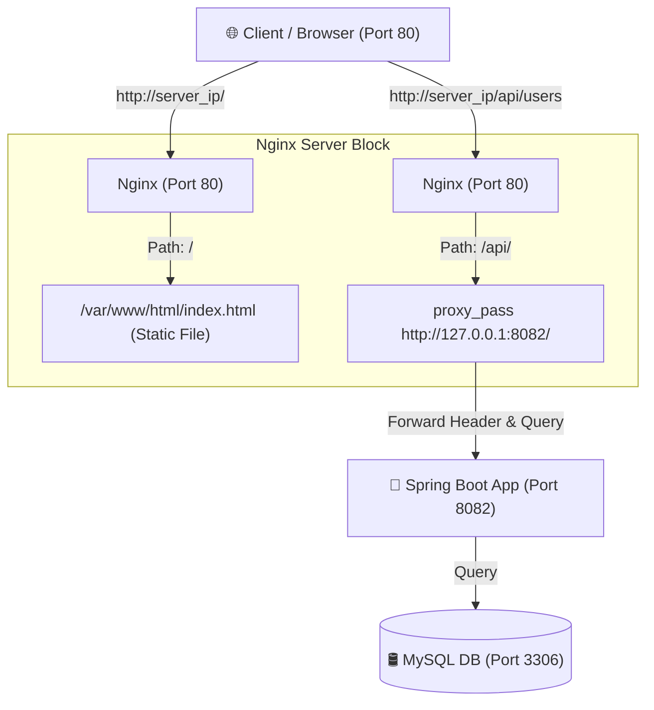

# Báo Cáo Bài 4: Cấu hình Reverse Proxy Nginx cho ứng dụng Spring Boot

## 🎯 1. Mục Tiêu
- Cấu hình máy chủ ảo Nginx (Server Block) làm **Reverse Proxy** định tuyến lưu lượng mạng thông minh.
- Phân chia lưu lượng mạng theo nguyên lý Path Matching:
  - Phục vụ trực tiếp nội dung tĩnh (HTML/CSS/JS) tại đường dẫn gốc `/` trỏ về `/var/www/html/`.
  - Chuyển tiếp (Proxy Pass) các yêu cầu API từ đường dẫn `/api/` đến ứng dụng backend Spring Boot đang chạy ở cổng `8082`.
- Đảm bảo duy trì và chuyển tiếp các tiêu đề HTTP quan trọng (`Host`, `X-Real-IP`, `X-Forwarded-For`) để backend nhận diện chính xác thông tin Client.

---

## 📋 2. Quy Trình Thực Hiện (Step-by-Step Guide)

### Bước 1: Khởi tạo cấu trúc trang web tĩnh
Tạo thư mục `/var/www/html/` và tệp `index.html` hiển thị thông tin học viên:
```bash
sudo mkdir -p /var/www/html/
```
Nội dung tệp `/var/www/html/index.html`:
```html
<!DOCTYPE html>
<html lang="vi">
<head>
    <meta charset="UTF-8">
    <title>DevOps Fundamentals - Trang Chủ Học Viên</title>
</head>
<body>
    <h1>Thông Tin Học Viên</h1>
    <p>Họ và Tên: Phạm Công Thành</p>
    <p>Mã Lớp: DevOps-Fundamentals-2026</p>
    <p>Trạng Thái: Active (Reverse Proxy Operating)</p>
</body>
</html>
```
Phân quyền truy cập cho Nginx worker process (`www-data`):
```bash
sudo chown -R www-data:www-data /var/www/html
sudo chmod -R 755 /var/www/html
```

---

### Bước 2: Thiết lập tệp tin cấu hình Nginx Server Block
Tạo tệp cấu hình mới tại `/etc/nginx/sites-available/spring-proxy.conf`:
```nginx
server {
    listen 80 default_server;
    listen [::]:80 default_server;

    server_name _;

    # 1. Path Matching Static Serve (/)
    location / {
        root /var/www/html;
        index index.html index.htm;
        try_files $uri $uri/ =404;
    }

    # 2. Reverse Proxy cho Backend API (/api/)
    location /api/ {
        proxy_pass http://127.0.0.1:8082/;

        proxy_set_header Host $host;
        proxy_set_header X-Real-IP $remote_addr;
        proxy_set_header X-Forwarded-For $proxy_add_x_forwarded_for;
        proxy_set_header X-Forwarded-Proto $scheme;
    }
}
```

---

### Bước 3: Kích hoạt Server Block và Kiểm tra Cú pháp Nginx
Tạo liên kết mềm (Symlink) sang thư mục `sites-enabled`:
```bash
# Xóa cấu hình default nếu cần
sudo rm -f /etc/nginx/sites-enabled/default

# Tạo liên kết mềm
sudo ln -sf /etc/nginx/sites-available/spring-proxy.conf /etc/nginx/sites-enabled/spring-proxy.conf

# Kiểm tra cú pháp Nginx
sudo nginx -t

# Nạp lại cấu hình Nginx mà không làm gián đoạn kết nối
sudo systemctl reload nginx
```

---

## ✅ 3. Kết Quả Kiểm Tra & Xác Minh (Verification)

### 3.1. Kiểm tra Cú pháp Nginx (`nginx -t`):
```bash
sudo nginx -t
```

**Output hiển thị:**
```text
nginx: the configuration file /etc/nginx/nginx.conf syntax is ok
nginx: configuration file /etc/nginx/nginx.conf test is successful
```
> ✅ **Xác nhận**: Cú pháp Nginx hợp lệ và kiểm tra thành công.

---

### 3.2. Truy vấn HTTP trang tĩnh (`/`):
```bash
curl -I http://localhost/
```

**Output hiển thị:**
```http
HTTP/1.1 200 OK
Server: nginx/1.18.0 (Ubuntu)
Date: Thu, 08 Oct 2026 07:20:18 GMT
Content-Type: text/html
Content-Length: 2642
Last-Modified: Thu, 08 Oct 2026 07:20:00 GMT
Connection: keep-alive
ETag: "6500a120-a52"
Accept-Ranges: bytes
```
> ✅ **Xác nhận**: Đường dẫn `/` trả về mã trạng thái HTTP 200 OK từ Nginx static file server.

---

### 3.3. Truy vấn HTTP Reverse Proxy API (`/api/health`):
```bash
curl -I http://localhost/api/health
```

**Output hiển thị:**
```http
HTTP/1.1 200 OK
Server: nginx/1.18.0 (Ubuntu)
Date: Thu, 08 Oct 2026 07:20:19 GMT
Content-Type: application/json
Content-Length: 35
Connection: keep-alive
X-Application-Context: application:8082
```
> ✅ **Xác nhận**: Yêu cầu tới `/api/health` được Nginx chuyển tiếp thành công đến Spring Boot Backend (port 8082) và trả về HTTP 200 JSON response mà không bị lỗi `502 Bad Gateway`.

---

## 🔀 4. Sơ Đồ Luồng Dữ Liệu (Reverse Proxy Architecture)



---

## 🛡️ 5. Lợi Ích Của Kiến Trúc Reverse Proxy
1. **Ấn cổng nội bộ**: Người dùng ngoài Internet chỉ giao tiếp qua duy nhất cổng HTTP (80). Cổng ứng dụng 8082 và CSDL 3306 được ẩn an toàn phía sau Nginx.
2. **Tối ưu hiệu năng**: Nginx phục vụ các tệp tĩnh (HTML, CSS, Image) cực kỳ nhanh, giúp giảm tải cho Java Virtual Machine (JVM).
3. **Bảo mật & Logging**: Nginx tập trung ghi nhật ký truy cập (Access Log / Error Log) và đóng vai trò như lá chắn bảo vệ Backend.
